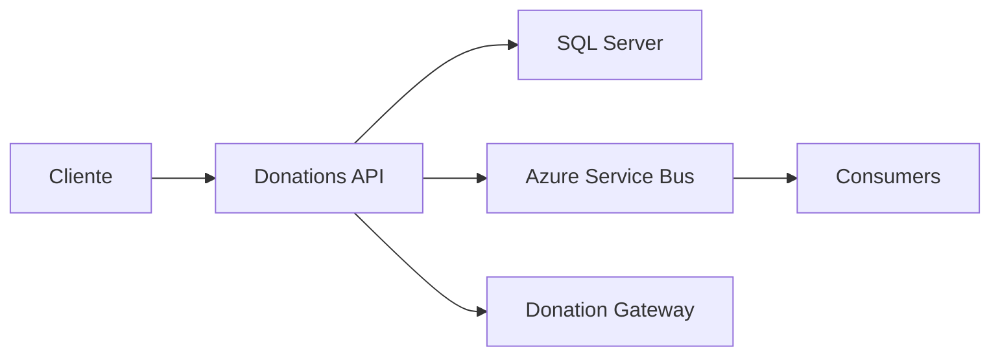
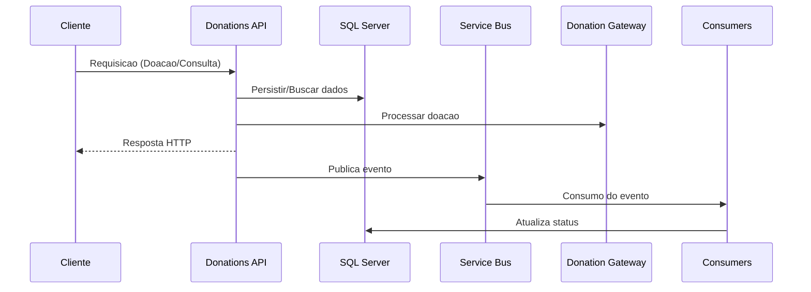
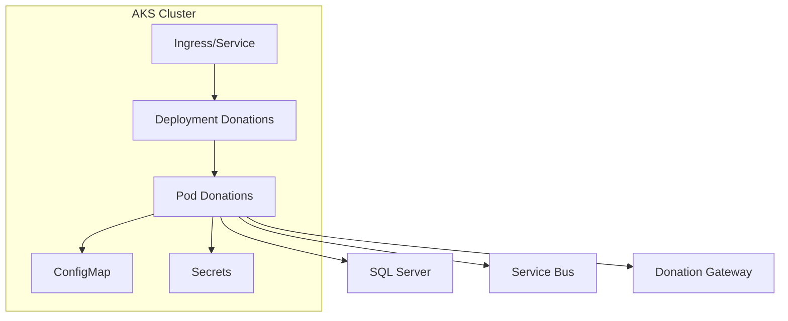

# SolidarityConnection.Donations

API de Donations do projeto Solidarity Connection. Responsavel por intake de doacoes, processamento assincrono e integracao com Service Bus.

## Conteudo

- Visao geral
- Estrutura do repositorio
- Requisitos
- Executar localmente
- Testes
- Docker
- Kubernetes (AKS)
- Configuracoes
- Pipelines

## Visao geral

Este servico expoe endpoints REST para intake e processamento de doacoes. Ele utiliza:

- SQL Server para persistencia
- Azure Service Bus para mensageria
- Donation Gateway externo (quando configurado)

## Arquitetura e fluxo



## Fluxo da aplicacao



## Estrutura do repositorio

- src/SolidarityConnection.Donations.Api: API Web
- src/SolidarityConnection.Donations.Application: regras de negocio
- src/SolidarityConnection.Donations.Domain: modelos de dominio
- src/SolidarityConnection.Donations.Infrastructure: persistencia e integracoes
- src/SolidarityConnection.Donations.Shared: contratos e utilitarios
- tests/SolidarityConnection.Donations.Tests: testes automatizados
- k8s/: manifests Kubernetes
- pipeline/: Azure Pipelines

## Requisitos

- .NET SDK 8.x
- Docker
- kubectl
- Azure CLI (para AKS)

## Executar localmente

1) Restaurar dependencias:

```bash
dotnet restore SolidarityConnection.Donations.sln
```

2) Executar a API:

```bash
dotnet run --project src/SolidarityConnection.Donations.Api/SolidarityConnection.Donations.Api.csproj
```

## Validacao local integrada com Core

Este servico e validado junto do Core API para comprovar o fluxo assincrono de doacao.

Use o guia completo no repositorio Core:

- `../fiap-solidarity-connection/others/docs/validacao-local-docker-compose.md`

Fluxo esperado na validacao:

1) Core publica `DonationRequestedEvent`.
2) Donations consome e processa.
3) Donations publica `DonationProcessedEvent`.
4) Core atualiza `total_raised_amount` na campanha.

## Testes

```bash
dotnet test SolidarityConnection.Donations.sln -c Release
```

## Docker

Build da imagem:

```bash
docker build -f src/SolidarityConnection.Donations.Api/Dockerfile -t solidarity-connection-donations:local .
```

Executar localmente:

```bash
docker run -p 8080:80 solidarity-connection-donations:local
```

## Kubernetes (AKS)

Manifests estao em k8s/.

Aplicar:

```bash
kubectl apply -f k8s/donations-configmap.yaml
kubectl apply -f k8s/donations-service.yaml
kubectl apply -f k8s/donations-deployment.yaml
kubectl apply -f k8s/donations-hpa.yaml
```

Verificar rollout:

```bash
kubectl rollout status deployment/solidarity-connection-donations
```

## Arquitetura no Kubernetes



## Configuracoes

Variaveis principais (exemplos):

- ConnectionStrings__DefaultConnection (Secret)
- ServiceBus__ConnectionString (Secret)
- PaymentGateway__BaseUrl (Secret)

## Pipelines

O pipeline esta em pipeline/azure-pipelines.yml e executa:

- Build
- Testes
- Build/Push da imagem
- Deploy no AKS (branches develop e main)

## Roteiro de apresentacao (15 minutos)

Roteiro detalhado da demonstracao:

- `../fiap-solidarity-connection/others/docs/roteiro-video-apresentacao-15min.md`
